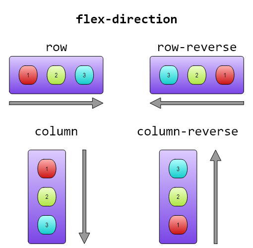
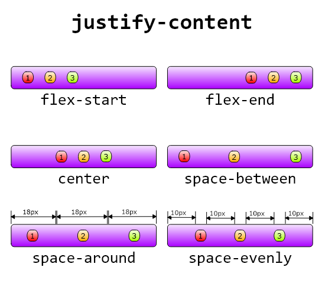
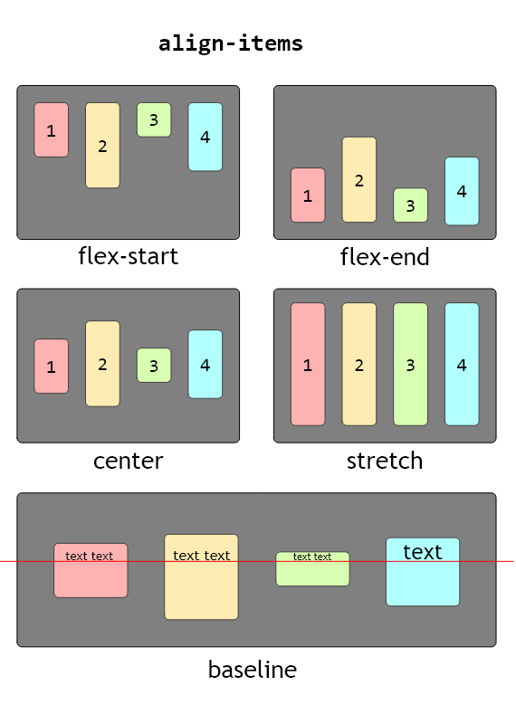
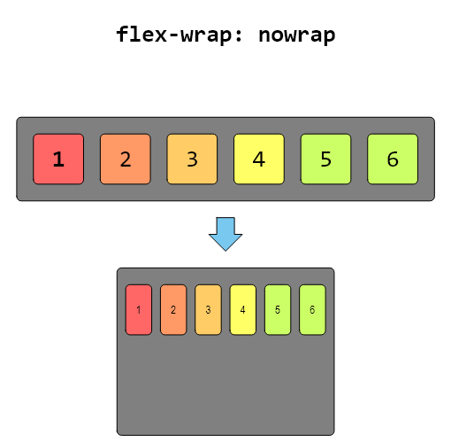
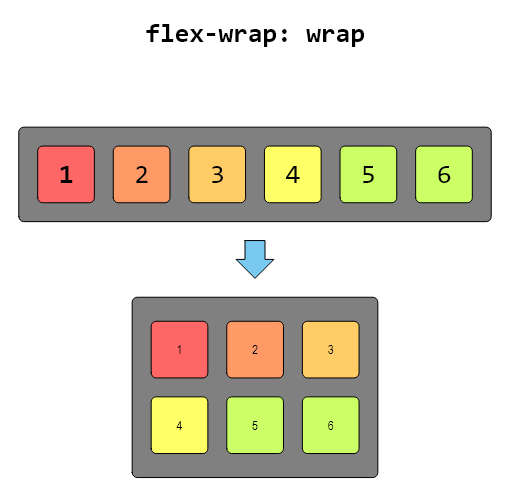
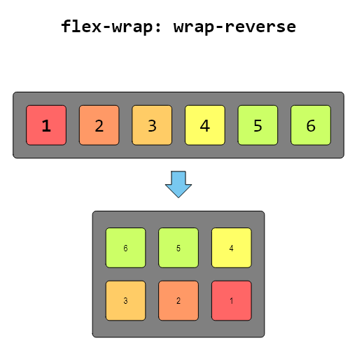

# Flexbox.

## Declaracion display flex;

La propiedad display: flex; en CSS establece un contenedor como un contenedor flexible, lo que permite aplicar un modelo de diseño flexbox a sus elementos secundarios (hijos). Flexbox es un modelo de diseño unidimensional que proporciona una forma eficiente de distribuir el espacio entre los elementos dentro de un contenedor y de alinearlos en varias maneras.

Cuando aplicas display: flex; a un contenedor, sus elementos secundarios (hijos directos) se convierten automáticamente en elementos flexibles, y el contenedor se convierte en un contenedor flexible.

Algunas propiedades asociadas a display: flex; incluyen:

- _flex-direction_: Esta propiedad establece la dirección principal en la que los elementos flexibles dentro del contenedor se apilan. Puede ser row (por defecto, de izquierda a derecha), row-reverse (de derecha a izquierda), column (de arriba a abajo) o column-reverse (de abajo a arriba).

```
.contenedor-flex {
  display: flex;
  flex-direction: row; /* También puede ser column, row-reverse, column-reverse */
}
```



- _justify-content_: Define cómo se distribuirán los elementos a lo largo del eje principal del contenedor. Puedes utilizar valores como flex-start (alineación al inicio), flex-end (alineación al final), center (al centro), space-between (distribución uniforme con espacio entre elementos), space-around (distribución uniforme con espacio alrededor de los elementos), etc.

```
.contenedor-flex {
  display: flex;
  justify-content: space-between; /* También puede ser flex-start, flex-end, center, space-around, space-evenly, etc. */
}
```


- _align-items_: Esta propiedad define cómo se alinearán los elementos a lo largo del eje transversal del contenedor. Puedes usar valores como stretch (se estiran para llenar el contenedor), flex-start (alineación al inicio), flex-end (alineación al final), center (al centro), baseline (alineación por la línea de base).

```
.contenedor-flex {
  display: flex;
  align-items: center; /* También puede ser flex-start, flex-end, stretch, baseline, etc. */
}
```



- _align-self_: Permite a un elemento individual anular la propiedad align-items para ese elemento en particular.

```
.hijo-flex {
  align-self: flex-end; /* También puede ser flex-start, center, stretch, baseline, etc. */
}
```

- _flex-wrap_: Controla si los elementos flexibles deben envolverse en múltiples líneas. Puede ser nowrap (por defecto, no se envuelve), wrap (se envuelve), o wrap-reverse (se envuelve en sentido inverso).

```
.contenedor-flex {
  display: flex;
  flex-wrap: wrap; /* También puede ser nowrap o wrap-reverse */
}
```





Estos son solo algunos ejemplos de las propiedades que puedes usar con display: flex;. El modelo de diseño flexbox ofrece una flexibilidad significativa para la creación de diseños y la alineación de elementos en una interfaz de usuario.

